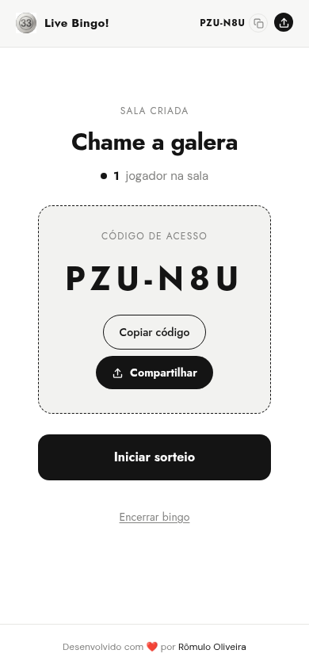
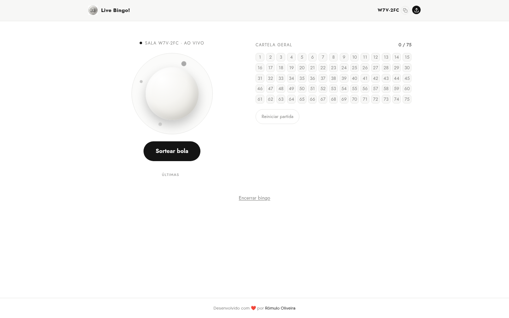

<div align="center">
  

  # Live Bingo!

  **Um sorteador de bingo gratuito e em tempo real. Sem aplicativo, sem cadastro, sem cartelas — só uma sala e um código compartilhado.**

  [](https://github.com/RomuloOliveira94/live-bingo/actions/workflows/ci.yml)

  
  
  
  
  
  
  

  [](LICENSE)
</div>

## O que é isso?

Live Bingo! é um **sorteador** de bingo — ele sorteia e chama os números, mas não é o jogo de bingo completo. Um anfitrião abre o app, cria uma sala e recebe um código de 6 caracteres. Os convidados digitam esse código em qualquer celular, tablet ou notebook — sem download, sem conta — e acompanham o mesmo sorteio ao vivo, em sincronia, conforme o anfitrião chama os números.

Não há cartelas pessoais nem detecção de vitória — isso é proposital. Este app resolve o único problema que realmente precisa ser resolvido em uma noite de bingo de verdade: garantir que todo jogador, em qualquer dispositivo, veja exatamente o mesmo número, exatamente ao mesmo tempo. As cartelas e a gritaria ficam por sua conta.

## Funcionalidades

- **Sorteios em tempo real** — cada número chamado é enviado a todos os convidados conectados via Turbo Streams / Action Cable; ninguém precisa atualizar a página.
- **Painel compartilhado de 1 a 75** — um painel único, atualizado ao vivo, com todos os números, marcando as bolas já sorteadas, idêntico para o anfitrião e todos os convidados.
- **Bola animada + som de sorteio** — cada sorteio gira uma bola animada e toca um efeito sonoro.
- **PWA instalável** — adicione à tela inicial e abra como um app nativo.
- **Compartilhamento nativo e código com um toque** — compartilhe a sala pelo menu de compartilhamento do sistema no celular, ou copie o código com um toque.
- **pt-BR / Inglês** — detecção automática de idioma (Accept-Language e depois país), sem precisar trocar manualmente.
- **Analytics com privacidade em mente** — contagem de visitas para entender o uso do produto, com IPs anonimizados antes de serem armazenados.
- **Mobile-first** — construído e ajustado primeiro para a tela do celular, escalando bem até o desktop.

## Capturas de tela

<table>
  <tr>
    <td align="center" width="33%"><br><sub>Início — criar ou entrar</sub></td>
    <td align="center" width="33%"><br><sub>Sala de espera — compartilhe o código</sub></td>
    <td align="center" width="33%"><br><sub>Sorteio ao vivo — desktop</sub></td>
  </tr>
</table>

## Stack tecnológica

| Camada | Escolha |
|---|---|
| Linguagem | Ruby 4.0.2 |
| Framework | Rails 8.1.3 |
| Front-end | Hotwire — Turbo Rails 2.0.23 + Stimulus Rails 1.3.4, via Importmap (**sem build de Node/JS**) |
| Estilização | Tailwind CSS v4 (`@theme` CSS-first, via a gem `tailwindcss-rails`) |
| Assets | Propshaft |
| Banco de dados | SQLite (todos os ambientes, incluindo produção) |
| Tempo real / jobs / cache | Solid Cable, Solid Queue, Solid Cache — todos baseados em SQLite, sem Redis |
| Testes | Minitest + Capybara/Selenium para testes de sistema, `shoulda-matchers` para specs de model |
| Deploy | Docker (Thruster na frente do Puma); CD contínuo para CapRover via GitHub Actions a cada push em `main`, com Kamal disponível para deploy manual |

## Como começar

```bash
git clone https://github.com/RomuloOliveira94/live-bingo.git
cd live-bingo
bin/setup      # bundle install, db:prepare, clears logs/tmp
bin/dev        # Puma + the Tailwind watcher (see Procfile.dev)
```

Depois, acesse `http://localhost:3000`.

O `bin/dev` executa o `Procfile.dev` via `foreman`, que inicia o servidor Rails (`web`) e o watcher do Tailwind CSS (`css`) lado a lado — sem precisar instalar um toolchain de frontend separado.

## Executando os testes

```bash
bin/rails db:test:prepare test    # 176 runs, 893 assertions
bin/rails test:system             # 34 runs
bin/rubocop                       # style, Rails Omakase config
bin/brakeman -q                  # static security analysis
```

Os quatro comandos estão passando (green) no momento deste README (0 failures, 0 offenses, 0 warnings) e rodam no CI a cada push e pull request (veja `.github/workflows/ci.yml`).

## Como funciona

- **Sem contas de usuário.** A identidade do anfitrião é um cookie assinado e `httponly` (veja `SessionData`), gerado no momento em que a sala é criada — nada para cadastrar, nada para lembrar. O mesmo cookie carrega um token de visitante anônimo por navegador, usado para analytics.
- **Um único fluxo de código para todo mundo.** Quando o anfitrião sorteia uma bola, a resposta renderiza esse sorteio inline para o anfitrião **e** transmite um Turbo Stream para todos os outros convidados conectados via Action Cable — assim o anfitrião não é um caso especial com lógica de renderização própria, é só a primeira pessoa a ver a atualização.
- **Atualização de página inteira com morph.** As transições de estado (waiting → active → finished) transmitem um `broadcast_refresh_to`, que o Turbo renderiza como uma atualização de página inteira via morph, em vez de um stream direcionado — assim todo convidado converge para exatamente o mesmo markup, independentemente da tela em que estava.
- **Resolução de idioma (locale)** verifica primeiro o `Accept-Language` da requisição (assim, uma preferência explícita por português sempre prevalece), depois recorre ao país do visitante via header `CF-IPCountry` da Cloudflare, e por fim ao idioma padrão do app (`pt-BR`) caso nenhum dos dois sinais esteja presente.

## Internacionalização

O app é totalmente localizado em pt-BR (padrão) e inglês, incluindo mensagens flash, metadados de SEO e o manifest do PWA. Há um teste dedicado (`test/i18n_hardcoded_strings_test.rb`) que varre todas as views em busca de texto literal não traduzido e falha o build caso algum passe despercebido — além de testes separados que garantem a paridade de chaves entre `pt-BR.yml`/`en.yml` e o comportamento de fallback do locale em português.

## Deploy

O deploy contínuo para produção roda no [CapRover](https://caprover.com/), disparado a cada push em `main` (`.github/workflows/cd.yml`). A `main` é protegida: um Pull Request só entra com uma aprovação e com os 5 checks do CI (`test`, `system-test`, `lint`, `scan_ruby`, `scan_js`) verdes, e o `.github/CODEOWNERS` já pede a revisão automaticamente. Depois do merge o gate se repete no próprio workflow: ele só implanta depois de confirmar que o CI (`.github/workflows/ci.yml`) passou **na mesma revisão** — esses 5 checks nunca são pulados nem duplicados, só aguardados. Também dá para disparar um redeploy manual pela aba Actions (`workflow_dispatch`).

Passado o gate, a imagem é construída **no próprio runner do GitHub Actions** (`docker/build-push-action`, a partir do `Dockerfile` da raiz) e publicada no GitHub Container Registry em duas tags:

| Tag | Para quê |
|---|---|
| `ghcr.io/romulooliveira94/live-bingo:<sha7>` | Tag imutável (7 primeiros caracteres do commit). É ela que o CapRover recebe — e a que se usa para rollback |
| `ghcr.io/romulooliveira94/live-bingo:latest` | Ponteiro para o último **build** da `main` — não necessariamente o que está no ar: um rollback troca a imagem do app sem mexer nesta tag. Conveniência para `docker pull` manual |

O CapRover **não constrói mais nada**: o workflow passa o nome da imagem para o `caprover/deploy-from-github` e o servidor só faz `docker pull`. Quem publica o pacote é o `GITHUB_TOKEN` do próprio workflow (o job declara `permissions: packages: write`) — nenhum PAT fica guardado no repositório. O cache de camadas do build fica no cache do Actions (`type=gha`), então um `Gemfile.lock` inalterado pula o `bundle install` na próxima execução.

⚠️ **Um run verde do CD não prova que o deploy subiu.** O step do CapRover retorna assim que o servidor *aceita* a requisição — deploy por App Token não transmite o log de build de volta —, então um `docker pull` que falha (PAT do registry expirado, registry errado) ou um container em crash loop aparecem **só** no painel do CapRover, nas abas **Deployment** e **App Logs**; o run do Actions continua verde. Depois de cada deploy, confira o `/up` do app.

O `captain-definition` na raiz continua versionado, mas **não é mais usado pelo CD**: ele serve apenas para um deploy manual por tarball (`caprover deploy`), em que o CapRover constrói a imagem no servidor.

### Registro do ghcr.io no CapRover (obrigatório)

Pacotes do GitHub Container Registry nascem **privados**, então o servidor precisa de credencial para baixar a imagem. Em **Cluster → Docker Registries** → *Add Remote Registry*:

| Campo | Valor |
|---|---|
| Registry Domain | `ghcr.io` |
| Username | seu usuário do GitHub (`RomuloOliveira94`) |
| Password | um PAT clássico com o escopo `read:packages` |

Sem isso o deploy falha no `docker pull` com `unauthorized`. (Alternativa: tornar o pacote público em **Packages** → o pacote → *Package settings* → *Change visibility*.)

### Rollback

As tags por SHA ficam todas no ghcr.io, então voltar uma versão não exige rebuild. No painel do CapRover, aba **Deployment** do app → **Deploy via ImageName**, informe a tag antiga e implante:

```
ghcr.io/romulooliveira94/live-bingo:<sha7-antigo>
```

### Segredos do GitHub Actions

Configure em Settings → Secrets and variables → Actions do repositório (nenhum destes vive no código):

| Secret | Valor |
|---|---|
| `CAPROVER_SERVER` | URL do servidor CapRover, ex.: `https://captain.apps.seu-dominio.com` |
| `CAPROVER_APP_NAME` | Nome do app cadastrado no CapRover |
| `CAPROVER_APP_TOKEN` | Token de deploy do app |

Para gerar o token: na aba **Deployment** do app no painel do CapRover, clique em **Enable App Token** e copie o valor gerado.

Não há secret para o `ghcr.io` — o push da imagem usa o `GITHUB_TOKEN` que o próprio Actions injeta. Se algum dia uma policy de organização bloquear a escrita de packages pelo `GITHUB_TOKEN`, crie um PAT clássico com `write:packages`, guarde-o em `secrets.ACCESS_TOKEN` e troque a senha do step de login do `cd.yml`.

### Variáveis de ambiente do app no CapRover

Em **App Configs** → **Environmental Variables**, configure:

| Variável | Obrigatória? | Para quê |
|---|---|---|
| `RAILS_MASTER_KEY` | **Sim** | Decripta `config/credentials.yml.enc` em runtime (é o mesmo valor de `config/master.key`, que não está no repositório). Sem ela o container sobe e derruba na inicialização. |
| `APP_HOST` | **Sim** | O domínio sob o qual o app está publicado, ex.: `live-bingo.seu-dominio.com`. Alimenta o `config.hosts` de `config/environments/production.rb`, que liga a proteção contra DNS rebinding e ataques de header `Host`. O domínio não está no código de propósito: este repositório é público. Enquanto estiver em branco o app funciona, mas sem essa proteção — o `config.hosts` fica no array vazio do padrão e o `ActionDispatch::HostAuthorization` nem chega a ser inserido. O `/up` é isento, então o health check do CapRover continua respondendo mesmo se o valor estiver errado. |
| `SOLID_QUEUE_IN_PUMA` | Não (ainda) | Sobe o supervisor do Solid Queue dentro do Puma (`config/puma.rb`) — é assim que esta app rodaria jobs em produção, sem processo worker separado. Hoje não há nenhum job (`app/jobs/` só tem o `ApplicationJob`) e nenhuma chamada a `perform_later`/`deliver_later`, então não faz diferença; no dia em que o primeiro job aparecer, sem ela ele fica enfileirado e nunca executa. |
| `RAILS_LOG_LEVEL` | Não | Padrão `info` (`config/environments/production.rb`). |

### Volume persistente (obrigatório)

O app usa SQLite para o banco principal **e** para Solid Queue, Solid Cache e Solid Cable (veja `config/database.yml`) — os quatro arquivos `.sqlite3` ficam em `storage/`, o que resolve para `/rails/storage` dentro do container (`WORKDIR /rails` no `Dockerfile`).

**Sem um volume persistente mapeado em `/rails/storage`, cada deploy apaga todas as salas e todo o histórico de analytics.** Configure em **App Configs** → **Persistent Directories**:

| Caminho no container | Rótulo (label) |
|---|---|
| `/rails/storage` | `live-bingo-storage` |

⚠️ **O rótulo precisa ser único em toda a instância do CapRover.** O CapRover converte o rótulo no volume Docker `captain--<rótulo>` **sem prefixar o nome do app**, então todos os apps da mesma instância dividem esse namespace. Um rótulo genérico como `db` ou `storage` monta em `/rails/storage` o volume `captain--db`, que provavelmente já é de outro app: o `db:prepare` do boot encontra um banco alheio já inicializado, tenta rodar as migrations desta app em cima dele e morre com um erro de tabela já existente, deixando o container em crash loop. Se não houvesse colisão de nomes de tabela seria pior — as migrations desta app seriam aplicadas no banco do outro app. Por isso o rótulo em uso aqui é `live-bingo-storage`.

Se isso já tiver acontecido, troque o rótulo por um único: o CapRover passa a montar um volume novo e vazio e o `db:prepare` cria os bancos desta app do zero. No volume compartilhado ficam para trás os `production_queue.sqlite3`, `production_cache.sqlite3` e `production_cable.sqlite3` que esta app criou — remova-os se o outro app não usar esses nomes.

O `bin/docker-entrypoint` roda `db:prepare` a cada boot, então o primeiro deploy cria e migra os quatro bancos sozinho.

### Health check

Configure o health check do CapRover para consultar `/up` — a rota padrão do Rails 8 (`rails/health#show`), já registrada em `config/routes.rb`.

### Porta e TLS

O `Dockerfile` expõe a porta `80` (`EXPOSE 80`, servida pelo Thruster), que já é o padrão do CapRover — nenhuma configuração extra de porta é necessária. O CapRover termina o TLS no próprio Nginx e encaminha HTTP simples para o container, e é justamente por isso que `config.assume_ssl` e `config.force_ssl` estão **ligados** em `config/environments/production.rb` — os dois juntos, que é a única combinação correta atrás de um proxy que termina TLS.

Foi essa mudança que corrigiu o 422 em todo request não-GET (commit `5b3c544`): sem `assume_ssl`, o Rails monta `request.base_url` como `http://…`, que nunca casa com o header `Origin` `https://` do navegador, e a checagem de mesma origem do CSRF rejeita o request. E não há loop de redirecionamento porque `assume_ssl` faz `request.ssl?` retornar sempre `true`, então o branch de redirect do `ActionDispatch::SSL` nunca dispara — nem no `/up`, o que dispensa o `config.ssl_options` de exclusão que o Rails deixa comentado ali.

## Licença

Este projeto está licenciado sob a [Licença MIT](LICENSE) — livre para usar, modificar e distribuir, com atribuição.

---

<div align="center">
  <sub>Desenvolvido com ❤️ por <a href="https://github.com/RomuloOliveira94">Rômulo Oliveira</a></sub>
</div>
